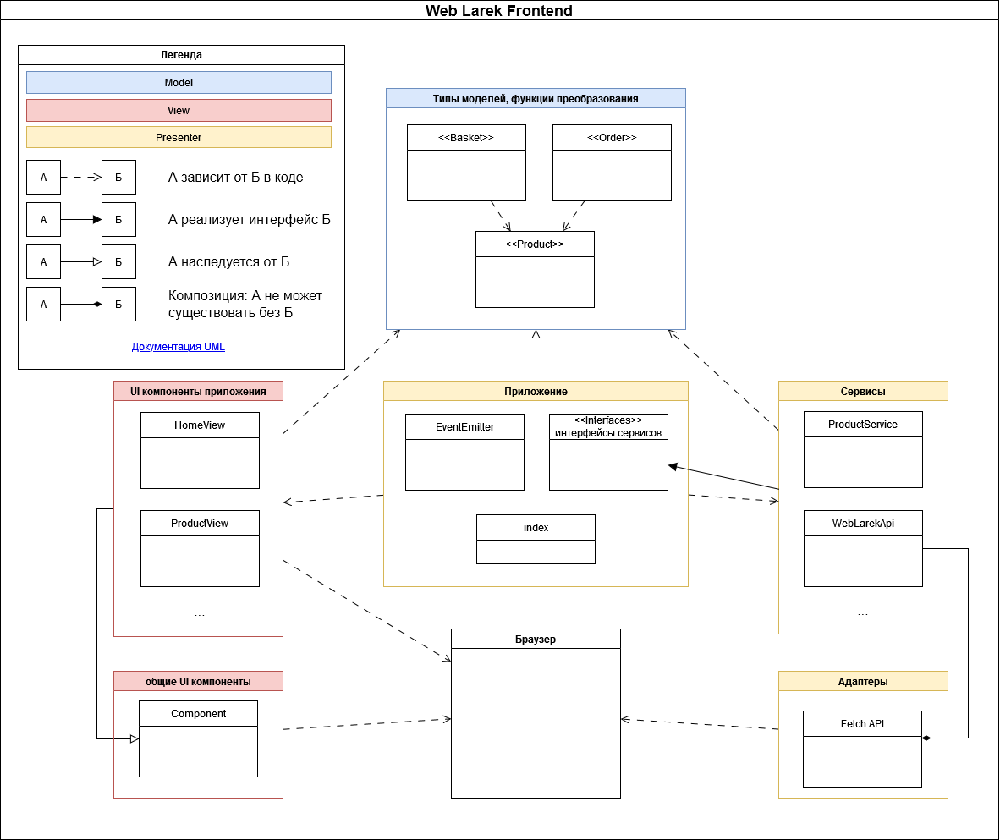

# Яндекс.Практикум: Проектная работа "Веб-ларек"

Стек: HTML, SCSS, TypeScript, Webpack

Структура проекта:

- src/ — исходные файлы проекта, модули слоя приложения
- src/adapters/ - модули слоя адаптеров - адаптеры API браузера
- src/app/ - файлы и модули слоя приложения
- src/common.blocks/ - файлы стилей для блоков
- src/components/ — UI компоненты приложения
- src/images/ - изображения
- src/models/ - модули для функций и классов обработки моделей
- src/pages/ - файлы html
- src/public/ - файлы, необходимые для сборки приложения
- src/scss/ - общие файлы стилей
- src/services/ - модули слоя сервисов
- src/types/ - типы, используемые приложением
- src/ui/ - модули слоя адаптеров - общие компоненты UI
- src/utils/ - вспомогательные функции и классы
- src/vendor/ - сторонние пакеты

Важные файлы:

- src/pages/index.html — HTML-файл главной страницы
- src/styles/styles.scss — корневой файл стилей
- src/index.ts — точка входа приложения
- src/types/index.ts — файл с типами
- src/utils/constants.ts — файл с константами
- src/utils/utils.ts — файл с утилитами

## Установка и запуск

Для установки и запуска проекта необходимо выполнить команды

```
npm install
npm run start
```

или

```
yarn
yarn start
```

## Окружение

Для правильной сборки проекта необходимо задать переменную окружения `API_ORIGIN`

## Сборка

```
npm run build
```

или

```
yarn build
```

## Архитектура

- ### Слой моделей
  - Элементы не зависят ни от чего, кроме элементов этого слоя
  - описывает модели данных и их преобразования
  - `types/index.ts`
    - `type Product` - товар
    - `type Basket` - корзина
    - `type Order` - заказ
- ### Прикладной слой

  - Модули и классы прикладного слоя могут использовать слой моделей и сервисный слой (сервисы и gui-компоненты приложения)
  - Здесь происходит инициализация брокера событий, создание сервисов и gui-компонентов, начальная инициализация приложения; описываются требуемые для приложения интерфейсы взаимодействия с внешним миром
  - `class EventEmitter`
    - Класс `EventEmitter` обеспечивает работу событий. Его функции: возможность установить и снять слушателей событий, вызвать слушателей при возникновении события
  - `index.ts`
    - точка входа в приложение
    - создание сервисов и gui-компонентов приложения
    - добавление событий в `EventEmitter` и подключение их обработчиков
    - запуск получения товаров с сервера и заполнение начальной страницы `Home`
  - интерфейсы взаимодействия с внешним миром
    - `IProductService`
    - `IBasketService`
    - `IOrderService`
    - `IWebLarekApi`

- ### Слой сервисов
  - Модули и классы сервисного слоя могут использовать модели и интерфейсы прикладного слоя, а так же иметь внутренние зависимости
  - В этом слое реализуются интерфейсы прикладного слоя
  - Сервисы, реализующие соответствующие интерфейсы:
    - `class ProductService`
    - `class BasketService`
    - `class OrderService`
    - `class WebLarekAPI`
  - UI-компоненты приложения, для сокращения времени разработки могут использовать WEB-api браузера
    - `class HomeView extends PageView`
      - главная страница
    - Другие компоненты отображения объектов приложения
- ### Слой адаптеров
  - Только UI-компоненты и элементы слоя адаптеров могут использовать API браузера
  - Этот слой взаимодействует непосредственно с браузером
  - Адаптеры браузерного API
    - `class Api`
  - общие компоненты UI
    - `class Component`

## Типы и классы

### Product

Товар

```typescript
type Product = {
	id: ProductId;
	description: string;
	image: string;
	title: string;
	category: string;
	price: number;
};
```

### Basket

Корзина

```typescript
type Basket = {
	items: Product[];
};
```

### Order

Заказ

```typescript
type Order = {
	payment: PaymentType;
	email: string;
	phone: string;
	address: string;
	total: number;
	items: ProductId[];
};
```

### SentOrder

Отправленный заказ

```typescript
type OrderId = string;
type OrderTotal = number;

type SentOrder = { id: OrderId; total: OrderTotal } & Order;
```

### ProductService

Получает список всех товаров или товар по идентификатору с сервера.

```typescript
interface IProductService {
	getProducts: () => Promise<Product[]>;
	getProduct: (id: ProductId) => Promise<Product>;
}
```

### BasketService

Работа с корзиной

```typescript
interface IBasketService {
	findItem: (product: Product) => number | undefined;
	addItem: (item: Product) => void;
	removeItem: (item: Product) => void;
	clear: () => void;
	count: () => number;
}
```

### OrderService

Отправляет заказ на сервер

```typescript
interface IOrderService {
	sendOrder: (order: Order) => Promise<SentOrder>;
}
```

### WebLarekApi

Взаимодействие с сервером "larek-api"

```typescript
interface IWebLarekApi {
	getProducts: () => Promise<Product[]>;
	getProduct: (id: ProductId) => Promise<Product>;
	postOrder: (order: Order) => Promise<SentOrder>;
}
```

### Component

Базовый компонент UI

```typescript
abstract class Component<T> {
	protected constructor(protected readonly container: HTMLElement) {...}

	// Инструментарий для работы с DOM в дочерних компонентах

	// Переключить класс
	toggleClass(element: HTMLElement, className: string, force?: boolean) {...}

	// Установить текстовое содержимое
	protected setText(element: HTMLElement, value: unknown) {...}

	// Сменить статус блокировки
	setDisabled(element: HTMLElement, state: boolean) {...}

	// Скрыть
	protected setHidden(element: HTMLElement) {...}

	// Показать
	protected setVisible(element: HTMLElement) {...}

	// Установить изображение с алтернативным текстом
	protected setImage(element: HTMLImageElement, src: string, alt?: string) {...}

	// Вернуть корневой DOM-элемент
	render(data?: Partial<T>): HTMLElement {...}
}
```

### PageView

Компонент, в котором находятся все нужные для работы HTML-элементы и шаблоны. Нужен для того, чтобы повторно их не искать в DOM

```typescript
abstract class PageView<T> extends Component<T> {
	// здесь должны быть все элементы, которые есть в HTML-странице
	protected ui: Record<string, HTMLElement | HTMLTemplateElement>;

	constructor() {...}
}
```

### HomeView

Компонент главной страницы. Содержит галерею товаров

```typescript
class Home extends PageView<IHomeModel> {
	private _gallery: HTMLElement;

	constructor(private events: IHomeEvents) {...}

	set gallery(items: Product[]) {...}
}
```

### ...View

Остальные компоненты наследуются от PageView

### Диаграмма

[Про UML](https://www.visual-paradigm.com/guide/uml-unified-modeling-language/uml-class-diagram-tutorial/)


